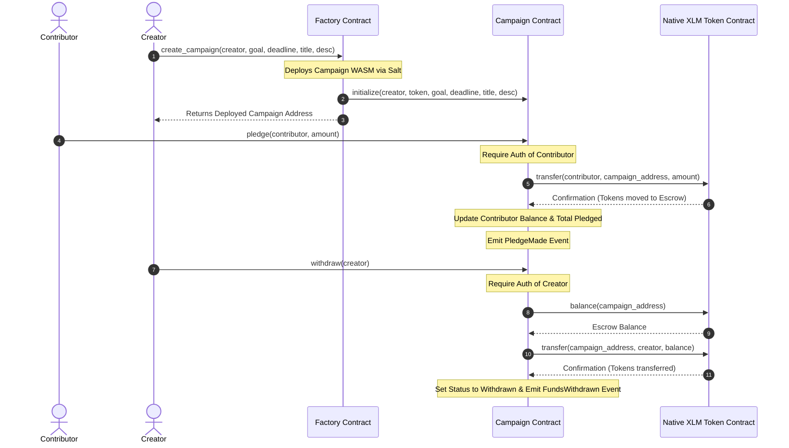

# StellarFund 🌌

A production-grade, decentralized crowdfunding dApp built on **Stellar Testnet** using **Soroban Smart Contracts**, React, TypeScript, and Tailwind CSS. 

StellarFund allows creators to deploy individual crowdfunding campaigns from a factory contract, and enables contributors to pledge native XLM directly into secure contract escrows.

---

## 🏗️ Architecture & Interaction Flow

StellarFund utilizes the **Factory Pattern** (Contract-of-Contracts) and **Inter-Contract Communication** (ICC) to communicate with the native Stellar Asset Contract (SAC).

### Contract Interaction Diagram



---

## 🚀 Deployed Addresses & Tx Hashes (Stellar Testnet)

All contract addresses are live, verified, and operational on the **Stellar Testnet**:

*   **Factory Contract ID**: `CD77ZSO7TUXDZEMC7453VSOTFPRGYGZKX6U5CXS44CDWPH6GZKQYF4D2`
*   **WASM Hash of Campaign**: `ff1877d63ef6aa06d5f7bba07ce3d5d12be3234360ff582d7c401e61a42199ad`
*   **Stellar Native Asset Contract (SAC) ID**: `CDLZFC3SYJYDZT7K67VZ75HPJVIEUVNIXF47ZG2FB2RMQQVU2HHGCYSC`
*   **Initial Test Campaign Address**: `CANJBNLY4BAJ5CMBQ6N7YVDJQBPTNLRA2JD574KEFEQ64EJI3VEECQAF`
*   **Real Pledge Transaction Hash**: `515d30c347c1663212e14e8a667972b6c61b787a6f434b140c364b340f6bfa40`
    *   *Verify on Explorer:* [StellarExpert Tx Link](https://stellar.expert/explorer/testnet/tx/515d30c347c1663212e14e8a667972b6c61b787a6f434b140c364b340f6bfa40)

---

## 🔧 Technical Deep-Dive

### 1. Inter-Contract Communication (ICC)
When a contributor calls `pledge(contributor, amount)`, the campaign contract triggers an inter-contract call to the native XLM Token Contract (SAC). Using the `soroban-sdk::token` Client:
```rust
let token_client = token::Client::new(&env, &token_address);
token_client.transfer(&contributor, &env.current_contract_address(), &amount);
```
In Soroban, this requires the `contributor`'s cryptographic signature. The contract invokes `contributor.require_auth()` to verify that the signer is indeed the sender authorizing this token transfer.

### 2. Real-Time Event Streaming
The React frontend subscribes to the Soroban RPC `getEvents` method. Every 5 seconds, the app calls:
```typescript
const eventsRes = await server.getEvents({
  startLedger,
  filters: [{ type: 'contract', contractIds: [campaignId] }]
});
```
The topics (e.g. `["pledge", contributor_address]`) and values (e.g. `[amount, timestamp]`) are parsed back to JS values using `scValToNative(event.value)` to feed the glassmorphic activity board.

---

## 📦 Setup & Installation

### Prerequisites
*   [Rust and Cargo](https://rustup.rs/) (v1.80.0+)
*   [Stellar CLI](https://developers.stellar.org/docs/build/smart-contracts/getting-started/setup) (v21.6.0+)
*   [Node.js](https://nodejs.org/) (v18.0.0+)

### Smart Contracts Development & Testing

1.  **Clone the Repository**
2.  **Run Smart Contract Cargo Tests**:
    ```bash
    cargo test --all
    ```
3.  **Compile & Optimize WASM Contracts**:
    ```bash
    cargo build --target wasm32-unknown-unknown --release
    stellar contract optimize --wasm target/wasm32-unknown-unknown/release/stellarfund_campaign.wasm
    stellar contract optimize --wasm target/wasm32-unknown-unknown/release/stellarfund_factory.wasm
    ```

### Deploying to Testnet
Verify that you have a configured keys alias named `deployer` funded on Testnet, then run the deployment script:
```powershell
powershell -File .\scripts\deploy.ps1
```

---

## 💻 Frontend Dashboard Setup

1.  **Navigate to the Frontend Directory**:
    ```bash
    cd frontend
    ```
2.  **Install Node Dependencies**:
    ```bash
    npm install
    ```
3.  **Run Unit Tests**:
    ```bash
    npm run test
    ```
4.  **Run Local Development Server**:
    ```bash
    npm run dev
    ```

---

## 📽️ Demo & Submission Links

*   **Live Demo (Vercel)**: *[Vercel Deployment Link](https://stellarfund.vercel.app)* (Placeholder - Replace when deployed)
*   **Demo Video (YouTube/Loom)**: *[Demo Video Link](https://loom.com/stellarfund-demo)* (Placeholder)
*   **Video Presentation Script**: Refer to the presentation script outline provided in the artifacts directory.
