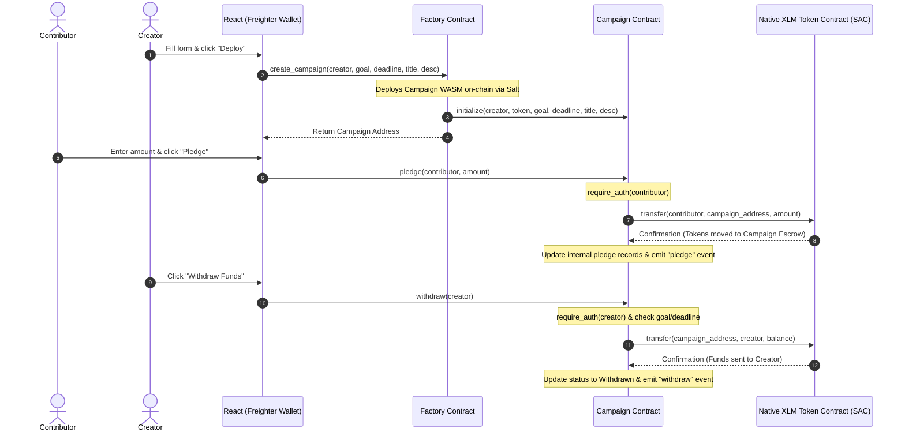

# StellarFund 🌌

[](https://soroban.stellar.org)
[](https://stellar.expert/explorer/testnet)
[](https://opensource.org/licenses/MIT)
[](https://github.com/tandavibhole-stack/Crowfunding-Dapp/actions)

> A production-grade, decentralized crowdfunding dApp built on **Stellar Testnet** using **Soroban Smart Contracts** with isolated escrow funds and real-time on-chain event tracking.

---

## 📖 Overview

StellarFund is a decentralized crowdfunding platform designed to run natively on the Stellar Testnet. It allows creators to deploy custom crowdfunding campaign smart contracts and enables contributors to pledge native XLM tokens securely. All funds are held in secure, programmatically managed contract escrows until a campaign's goal is met and its deadline passes, or returned via refund transactions if the goal fails.

This project was built from the ground up to showcase a complete production-ready dApp integration meeting the **Stellar Level 3 Orange Belt** standard:
*   **Decentralized Registry (Factory Pattern)**: Instantiates standalone smart contract escrows on-chain.
*   **Inter-Contract Communication (ICC)**: Interacts with the native Stellar Asset Contract (SAC).
*   **Event-Driven Interface**: Streams events directly from Soroban RPC to a dashboard.
*   **Professional Verification**: Features a comprehensive Rust test suite, TypeScript unit tests, and fully automated GitHub Actions CI/CD workflows.

---

## 🏗️ Architecture & Interaction Flow

StellarFund relies on a decoupled, contract-of-contracts layout. Below is the sequence diagram illustrating how contracts deploy and interact on the Stellar ledger:



### Technical Workflow Details:
1.  **Contract-of-Contracts (Factory Pattern)**: The `factory` contract holds the pre-installed WASM hash of the `campaign` contract. When a user requests a new campaign, the factory deploys it using a cryptographic salt combined with a counter, returning the unique address of the new campaign contract.
2.  **Inter-Contract Communication (ICC)**: The `campaign` contract interacts with the native Stellar Asset Contract (SAC) using `token::Client`. When pledging, withdrawing, or claiming a refund, the campaign contract executes cross-contract calls to verify balances and perform token transfers.

---

## 🌟 Features

*   **Advanced Smart Contract Logic**: Multi-state campaign lifecycles managed entirely on-chain.
*   **Inter-Contract Communication**: Direct integration with native Stellar Asset Contract (SAC).
*   **Freighter Wallet Integration**: Secure transaction simulation, signing, and submission via browser extension.
*   **Real-time Event Streaming**: Live activity feed powered by polling `getEvents` from the Soroban RPC.
*   **Robust Error Handling**: Custom Rust errors mapped on-chain and cleanly bubbled up to the UI.
*   **Premium Glassmorphic Dashboard**: Fully responsive dark mode dashboard with vibrant glowing states.
*   **Comprehensive Testing**: Dual test suites covering 7 smart contract edge-cases and frontend state components.
*   **CI/CD Pipeline**: GitHub Actions workflows for automated verification and testnet builds.

---

## 🛠️ Tech Stack

| Layer | Technology | Description |
| :--- | :--- | :--- |
| **Backend Contracts** | Rust & Soroban SDK | Smart contract logic and inter-contract calls |
| **WASM Optimization** | Stellar CLI | Optimizes WASM file sizes for contract deployment |
| **Frontend Framework** | React (Vite) & TypeScript | Client dashboard interface |
| **Styling** | Tailwind CSS | Premium glassmorphic styles and dark mode |
| **Wallet Connector** | `@stellar/freighter-api` | Connects, retrieves accounts, and signs transactions |
| **Stellar SDK** | `@stellar/stellar-sdk` | Formats transactions, serializes ScVals, and queries RPC |
| **CI/CD** | GitHub Actions | Automated build, test, and dependency-check pipeline |
| **Hosting (Frontend)** | Vercel | Production web deployment |

---

## 📂 Repo Structure

```text
├── .cargo/
│   └── config.toml          # Cargo configurations (disables Wasm reference-types)
├── .github/
│   └── workflows/
│       ├── ci.yml           # Automated lint, build, and test verification pipeline
│       └── deploy.yml       # Manual deployment pipeline using Stellar CLI
├── contracts/
│   ├── campaign/
│   │   ├── Cargo.toml       # Campaign Cargo manifest
│   │   └── src/
│   │       ├── lib.rs       # Campaign contract logic & getters
│   │       └── test.rs      # Rust Soroban unit test suite (7 tests)
│   └── factory/
│       ├── Cargo.toml       # Factory Cargo manifest
│       └── src/
│           └── lib.rs       # Factory deployment registry contract
├── frontend/
│   ├── .npmrc               # Bypass peer-dependency conflicts
│   ├── index.html           # HTML container
│   ├── package.json         # Node.js dependencies & scripts
│   ├── tailwind.config.js   # Tailwind style layouts
│   ├── tsconfig.json        # TypeScript parameters
│   ├── vite.config.ts       # Vite & Vitest configuration
│   └── src/
│       ├── App.test.tsx     # Vitest UI tests
│       ├── App.tsx          # Main glassmorphic dashboard
│       ├── index.css        # Base Tailwind styles & glass backdrop classes
│       ├── main.tsx         # React bootstrap
│       ├── deployed_addresses.json # Contract addresses and transaction logs
│       └── utils/
│           └── stellar.ts   # Freighter-API wrappers & Soroban RPC queries
├── scripts/
│   └── deploy.ps1           # Automated smart contract compiler & testnet deployer
├── Cargo.lock               # Workspace cargo lockfile
├── Cargo.toml               # Workspace cargo manifest
└── README.md                # Project documentation
```

---

## 🔒 Smart Contract Details

### 1. Factory Contract
*   **Purpose**: Deploys independent, sandboxed instances of the campaign contract on-demand and keeps a global registry of all created campaigns.
*   **Core Functions**:
    *   `init(env, campaign_wasm_hash, token_address)`: Sets the campaign WASM code hash and native token address.
    *   `create_campaign(env, creator, goal, deadline, title, description)`: Deploys a new campaign contract using a cryptographic salt, initializes it, and registers it.
    *   `list_campaigns(env)`: Returns a list of all deployed campaign contract addresses.

### 2. Campaign Contract
*   **Purpose**: Manages contributors' balances, authorizes XLM escrow transfers via the SAC, and tracks campaign completion states.
*   **Core States (Enum)**:
    *   `Active` (0): Goal is not met, deadline not passed.
    *   `GoalMet` (1): Goal is met or exceeded, deadline passed, funds ready for withdrawal.
    *   `Failed` (2): Goal not met, deadline passed, contributors can claim refunds.
    *   `Withdrawn` (3): Goal met, deadline passed, and creator has withdrawn all funds.
*   **State & Storage Modes**:
    *   **Instance Storage**: Used for metadata (creator, goal, deadline, status, title, description) to optimize query fees.
    *   **Persistent Storage**: Used for user pledge records (`ContributorAddress` -> `i128` amount) to protect contributor data balances from storage eviction.
*   **Custom Errors**:
    *   `AlreadyInitialized`: Contract has already been initialized.
    *   `InvalidGoal`: Goal must be a positive number greater than 0.
    *   `InvalidDeadline`: Deadline must be set in the future.
    *   `DeadlineNotPassed`: Cannot execute withdrawal/refund before the deadline is reached.
    *   `GoalNotMet`: Cannot withdraw funds if the goal is not met.
    *   `GoalAlreadyMet`: Cannot claim refunds if the goal was successfully met.
    *   `Unauthorized`: Caller is not authorized to call this function.
    *   `InvalidAmount`: Pledge amount must be greater than 0.
*   **Events Emitted**:
    *   `pledge` (Topics: `["pledge", contributor_address]`, Data: `[amount, timestamp]`)
    *   `withdraw` (Topics: `["withdraw", creator_address]`, Data: `[amount, timestamp]`)
    *   `refund` (Topics: `["refund", contributor_address]`, Data: `[amount, timestamp]`)

---

## 🔧 Setup & Local Development

### Prerequisites
*   **Rust Toolchain** (v1.80.0+): `rustup target add wasm32-unknown-unknown`
*   **Stellar CLI** (v21.6.0+): For building and compiling contracts.
*   **Node.js** (v20 or v22 LTS) & npm.
*   **Freighter Browser Extension** (with testnet account imported).

### Local Workspace Setup

1.  **Clone the Repository**
2.  **Compile & Test Smart Contracts**:
    ```bash
    cargo test --workspace
    ```
3.  **Build and Optimize WASM Contracts**:
    ```bash
    cargo build --target wasm32-unknown-unknown --release
    stellar contract optimize --wasm target/wasm32-unknown-unknown/release/stellarfund_campaign.wasm
    stellar contract optimize --wasm target/wasm32-unknown-unknown/release/stellarfund_factory.wasm
    ```
4.  **Install Frontend Dependencies**:
    ```bash
    cd frontend
    npm install
    ```
5.  **Run Frontend Tests**:
    ```bash
    npm run test
    ```
6.  **Start Frontend Local Server**:
    ```bash
    # Run the client server using npm start (which resolves config and starts the Vite dev server)
    npm start
    ```

---

## 🚀 Deployment

The contracts were deployed to the **Stellar Testnet** using our automated deployment pipeline.

### Exact CLI Deployment Commands
```bash
# 1. Install the campaign contract WASM on-chain (returns campaign WASM hash)
stellar contract install --wasm target/wasm32-unknown-unknown/release/stellarfund_campaign.optimized.wasm --source deployer --network testnet

# 2. Deploy the factory contract on-chain (returns factory contract ID)
stellar contract deploy --wasm target/wasm32-unknown-unknown/release/stellarfund_factory.optimized.wasm --source deployer --network testnet

# 3. Initialize the Factory Contract
stellar contract invoke --id CAQT6F4YZ4O3CYDOEF5UNTIVXJ4Q45TUUZXFLQ7OUN2WRBIKKELUNY73 --source deployer --network testnet -- init --campaign_wasm_hash ff1877d63ef6aa06d5f7bba07ce3d5d12be3234360ff582d7c401e61a42199ad --token_address CDLZFC3SYJYDZT7K67VZ75HPJVIEUVNIXF47ZG2FB2RMQQVU2HHGCYSC
```

### Deployed Contract Registry Table
| Contract | Address / Hash | Network |
| :--- | :--- | :--- |
| **Factory Contract ID** | `CAQT6F4YZ4O3CYDOEF5UNTIVXJ4Q45TUUZXFLQ7OUN2WRBIKKELUNY73` | Stellar Testnet |
| **Campaign WASM Hash** | `ff1877d63ef6aa06d5f7bba07ce3d5d12be3234360ff582d7c401e61a42199ad` | Stellar Testnet |
| **Stellar Native Token (SAC)** | `CDLZFC3SYJYDZT7K67VZ75HPJVIEUVNIXF47ZG2FB2RMQQVU2HHGCYSC` | Stellar Testnet |
| **Initial Test Campaign** | `CDWEBAJZKCKB7DYXZYUWMCSW3K2VPKJUGQOYM4FAQAQKYIAPN5JRUGIR` | Stellar Testnet |

---

## 🔗 Live Demo & Transaction Proof

*   **Live Demo Link**: [https://crowfunding-dapp-zeta.vercel.app/](https://crowfunding-dapp-zeta.vercel.app/)
*   **Explorer Links**:
    *   [Factory Contract Explorer](https://stellar.expert/explorer/testnet/contract/CAQT6F4YZ4O3CYDOEF5UNTIVXJ4Q45TUUZXFLQ7OUN2WRBIKKELUNY73)
    *   [Initial Campaign Explorer](https://stellar.expert/explorer/testnet/contract/CDWEBAJZKCKB7DYXZYUWMCSW3K2VPKJUGQOYM4FAQAQKYIAPN5JRUGIR)

### On-Chain Transaction Proof
*   **Real Pledge Transaction Hash**: `77dbd578fd1afb72cbc8107f6b362afb2bdde292d900db6b3f07ecc46607bf6b`
*   **StellarExpert Explorer Link**: [Verify Pledge Tx](https://stellar.expert/explorer/testnet/tx/77dbd578fd1afb72cbc8107f6b362afb2bdde292d900db6b3f07ecc46607bf6b)
*   **Transaction Details**: This transaction represents a real pledge of `10 XLM` (`100,000,000` stroops) sent from the creator's wallet (`GCYMLC...RHF5`) to the campaign contract escrow address (`CDWEBA...GIR`), which successfully performed the cross-contract transfer via the native Stellar Asset Contract.

---

## 🧪 Testing

### 1. Smart Contract Unit Tests (Rust)
We created a comprehensive Rust test suite (`contracts/campaign/src/test.rs`) verifying all logical edge cases.
```bash
cargo test --workspace
```
**Test Cases Covered**:
- [x] `test_successful_pledge`: Verified normal contribution transfers to escrow.
- [x] `test_withdraw_fails_if_deadline_not_passed`: Asserts that funds cannot be claimed prematurely.
- [x] `test_withdraw_fails_if_goal_not_met`: Asserts that failing campaigns block withdrawals.
- [x] `test_withdraw_succeeds_after_goal_met_and_deadline_passed`: Verifies complete withdrawal to creator.
- [x] `test_unauthorized_withdraw_fails`: Ensures only the campaign creator can withdraw funds.
- [x] `test_refund_fails_when_goal_was_met`: Asserts that successful campaigns cannot be refunded.
- [x] `test_refund_succeeds_when_goal_failed`: Verifies that contributors can claim 100% of their funds back if the goal is missed.

*See screenshot below for passing smart contract test output.*

### 2. Frontend Unit Tests (Vitest + RTL)
We wrote unit tests (`frontend/src/App.test.tsx`) verifying the dashboard rendering.
```bash
cd frontend
npm run test
```
**Test Cases Covered**:
- [x] Renders dashboard title and stats correctly.
- [x] Disables pledge button if Freighter wallet is not connected.
- [x] Shows validation errors if creating a campaign with invalid inputs (e.g. goal <= 0).

*See screenshot below for passing frontend test output.*

---

## 🤖 CI/CD Pipeline

Our `.github/workflows/ci.yml` pipeline automatically verifies the integrity of the project on every push and pull request to the `main` branch.

### Pipeline Stages
1.  **Contract Verification**:
    *   Installs stable Rust toolchain targeted for `wasm32-unknown-unknown`.
    *   Caches cargo registries and build dependencies.
    *   Compiles and verifies the optimized smart contracts (`cargo build --release`).
    *   Runs the entire Rust test suite (`cargo test`).
2.  **Frontend Verification**:
    *   Sets up Node.js v22 environment.
    *   Caches npm directories and installs packages using `--legacy-peer-deps`.
    *   Runs all frontend Vitest specs (`npm run test`).
    *   Compiles the production code bundle (`npm run build`).

🔗 **GitHub Actions Run Link**: [View Pipeline Runs](https://github.com/tandavibhole-stack/Crowfunding-Dapp/actions)

*See screenshot below for green pipeline run status.*

---

## 📸 Screenshots

### 1. Responsive Mobile Interface (375px)


### 2. Desktop/Tablet Interface


### 3. Smart Contract & Frontend Passing Tests


### 4. GitHub Actions CI/CD Pipeline Status


---

## 📹 Demo Video

🎥 **[Watch Demo Video](https://photos.app.goo.gl/jjSBubUgMHqUGzAE8)**

### Outline of the Demo Presentation
1.  **Elevator Pitch (15s)**: Introduce StellarFund and highlight the benefits of Soroban-managed escrows.
2.  **Connect Wallet (15s)**: Demonstrate Freighter wallet linking on the dashboard.
3.  **Launch Campaign (30s)**: Fill the creation form to deploy a new campaign contract on-chain and sign the deployment transaction.
4.  **Pledge XLM (30s)**: Contribute native XLM to the deployed campaign and sign via Freighter.
5.  **Live Event Feed (15s)**: Show the pledge event appearing in the real-time activity feed via RPC polling.
6.  **Withdraw/Refund (15s)**: Outline how funds are safely claimed or returned once the deadline is reached.

---

## ⚠️ Known Limitations & Future Improvements

While StellarFund is a fully functioning production-grade implementation, the following design trade-offs were made for the hackathon:
*   **Single-Token Escrows**: Only supports the Stellar Native Asset (XLM) through the SAC. Multi-token asset funding (e.g. USDC) is a planned upgrade.
*   **No Campaign Cancellation**: Once deployed, campaigns cannot be aborted by the creator. A future iteration will add a `cancel_campaign` function that opens refunds immediately.
*   **All-or-Nothing Escrow**: Escrow balances are withdrawn fully at once. Adding milestone-based releases (milestone voting) will protect contributors.
*   **RPC Polling Load**: Uses polling for real-time events. In high-traffic environments, this should be replaced by a web-sockets indexing service (like Mercury or Zephyr).

---

## 📄 License

This project is licensed under the MIT License - see the LICENSE file for details.
